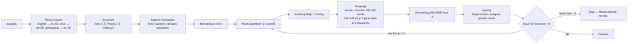
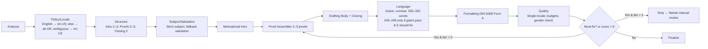

## 10 tips for writing cover letters (relevant for the structural agent)

1. Personalized approach and research: Tailor your cover letter to the company and the specific position. Avoid using generic templates or mass cover letters—research the appropriate contact person and address them by name. A personal reference (e.g., why this particular company) shows interest; mistakes such as impersonal phrases (“Dear Sir or Madam”) come across as unprofessional.

2. Analyze the job requirements: Read the job advertisement thoroughly and identify the most important requirements. In your cover letter, emphasize the qualifications that are essential for the job. Provide relevant examples from your career that demonstrate these points. This will show that you really do have the skills they are looking for and that you are prepared for the job.

3. Pay attention to clear structure and formalities: Stick to the format of a business letter. Your address (including contact details) and the recipient's address should be at the top left, with the place and date on the right. Write the subject line (in italics or bold), e.g., “Application for ...” (without the word “Subject:”). Make sure to use a personal salutation (“Dear Mr./Ms. Name,”—don't forget the comma and continue in lowercase). A common mistake is an incorrect address or missing information; check all formalities carefully.

4. Compelling opening sentence & motivation: In the first paragraph, you should spark interest: Name the exact position and how you became aware of it (e.g., job advertisement, recommendation). Immediately explain why this particular position or company appeals to you. Avoid clichés such as “I am writing to apply for...” Instead, use specific openings (e.g., a brief success story or a reference to the industry) that authentically convey your motivation.

5. Relevant skills with examples: In the main section, focus on your strengths and experiences that are relevant to the position. Instead of simply listing them (“I am a team player, resilient...”), you should back up these qualities with specific examples. Describe a project or achievement that demonstrates your teamwork skills or expertise. This avoids empty platitudes and makes your profile more tangible.

6. Benefits for the employer: Shift your perspective—the recruiter is asking themselves, “What does this candidate bring to our company?” Therefore, emphasize the added value you bring (e.g., how your skills will help achieve a current company goal). Show that you have researched the company and its goals. A concrete example: “In my current position, I was able to achieve X Y, which will directly advance your project Z.” This emphasizes that only your application offers the company a real advantage.

7. Active, confident writing style: Avoid subjunctive phrases such as “I would be happy to.” Instead, write in an active style (“I am looking forward to...,” “I have achieved...”). Use expressive verbs and clear, short sentences. Be confident without coming across as arrogant: authenticity counts. Typical mistakes include vague or uncertain phrasing—these come across as unprofessional and weaken your argument.

8. Conciseness and length: Keep your cover letter short and concise—it should be no longer than one A4 page. Work out the core of your message and delete anything superfluous. Long, convoluted sentences, filler words, or repetitions have no place here. Quality over quantity: A clear, concise cover letter is easier to read and makes a better impression.

9. Professional layout (DIN 5008): Ensure a clean, consistent design. Use a reputable font (e.g., Arial, Calibri, Times New Roman) in 10–12 pt and consistent formatting for addresses, paragraphs, etc. Stick to DIN A4 format with appropriate margins. Avoid playful or overly colorful designs—only in very creative industries does an eye-catching layout make sense. A professional overall impression helps ensure that your text is taken seriously.

10. Proofreading and fine-tuning: Typos and spelling mistakes are a no-go. Therefore, be sure to have someone else proofread your cover letter and, ideally, review it again the next day. Also make sure you use a friendly closing (e.g., “Best regards”) and list any attachments at the end (e.g., “Attachments: resume, references”). An error-free, well-rounded ending shows care and leaves a good final impression on the application.

## Multi-agent system overview

This system generates one-page cover letters according to DIN 5008 (Form A) with a strict, locale-aware policy and a gated, iterative orchestration. It is implementation-agnostic and defines agent scopes, data handoffs, and prompts only.

### Orchestration and gates

- Sequence per iteration: Analysis → Policy/Locale → Structure → Subject/Salutation → Motivational (intro) → Proof Assembler (2–3 proofs) → Drafting (body + closing) → Language → Formatting → Quality → Feedback → Coordination decision.
- Section budgets: intro 2–3 sentences; body proofs minimum 2 (allow 2–3); closing 2 sentences.
- Word budgets: soft minimum 250; hard maximum 320. Allow 240–249 only if all gates pass and Quality has zero should-fix warnings.
- Locale/date policy: derive from job ad language. If English → en-US; else → de-DE; ambiguous/mixed → default en-US. Use DIN 5008 Form A and format date per resolved locale.
- Subject policy: strict templates only — en-US: “Application for {Role}”; de-DE: “Bewerbung als {Rolle}”. No creative variants.
- Salutation policy: when contact missing, en-US → “Dear Hiring Manager,”; de-DE → “Sehr geehrte Damen und Herren,”. Creative variants are permitted only in body tone for creative roles; never in the subject.
- Must-fix rules: German named-salutation gender mismatch is a must-fix. Mixed locales fail. Over/under section budgets fail. Word budget violations fail.
- Iteration loop: Repeat targeted steps if Feedback < 8/10 or any must-fix remains. Stop when Feedback ≥ 8/10 and must-fix = 0, or after 3 iterations (then return best version with “needs manual review”).
- Optional mirror output for ambiguous language: disabled by default; only produce a secondary other-locale variant if a policy flag requests it.

### Shared data contract (concise)

```
policy: {
  locale: 'en-US' | 'de-DE',
  ambiguous: boolean,
  mirrorOtherLocaleEnabled: boolean, // default false
  dinForm: 'A',
  dateFormat: 'derived-from-locale',
  subjectTemplates: { enUS: 'Application for {Role}', deDE: 'Bewerbung als {Rolle}', strict: true },
  salutation: { fallbackEn: 'Dear Hiring Manager,', fallbackDe: 'Sehr geehrte Damen und Herren,', creativeInBodyForCreativeRoles: true }
}
budgets: {
  wordsSoftMin: 250,
  wordsExceptionMin: 240,
  wordsHardMax: 320,
  sections: { introSentences: [2,3], bodyProofsMin: 2, bodyProofsMax: 3, closingSentences: 2 },
  exceptionConditions: { allGatesPass: true, shouldFixEqZero: true }
}
jobAd: { text: string, detectedLanguage: string, roleTitle?: string, companyName?: string, contactName?: string, contactGender?: 'm'|'f'|'div'|null }
applicant: { name: string, contact: object, experiences: object[], skills: string[], achievements: object[] }
roleContext: { creativeRole: boolean }
outline: { subject: string, salutation: string, sections: { intro: {sentences:number}, body: {proofs:number}, closing: {sentences:number} } }
draft: { intro: string, proofs: { id: string, text: string, evidenceRef?: string }[], closing: string, text: string, wordCount: number }
quality: { mustFix: string[], shouldFix: string[], germanGenderMismatch: boolean, singleLocale: boolean, subjectStrict: boolean, budgetsOK: boolean, wordBudgetOK: boolean }
feedback: { score: number, notes: string[] }
iteration: { current: number, cap: 3, stopReason?: string }
provenance: { analysisId?: string, agents: Record<string,string> }
```

## Agent specifications (responsibilities • inputs • outputs • system prompt)

Each agent must only write its designated keys and preserve all other fields.

1) Coordination-Agent
- Responsibilities: orchestrate sequence and iterations; enforce locale/subject/salutation/budgets; merge outputs; decide convergence.
- Inputs: policy, budgets, jobAd, applicant, outline, draft, quality, feedback, iteration.
- Outputs: iteration (decision, stopReason), draft.text (merged), provenance.
- System prompt: You are the Coordinator. You do not generate new prose. You orchestrate sub-agents exposed as MCP tool calls, pass only required inputs, and merge only the keys each sub-agent owns into shared state. Your writable keys are iteration and provenance; you also select the best current draft.text at convergence. Locale is immutable after policyLocale resolves it.

  MCP tools (concise ids) and single-iteration call order (no reordering): analysis → policyLocale → structural (includes subject/salutation) → motivational → proofs → drafting → language → formatting → quality → feedback.

  Per tool, forward inputs and merge only designated outputs:
  - analysis
    - Inputs: jobAd.text
    - Outputs: jobAd.detectedLanguage, jobAd.roleTitle, jobAd.companyName, jobAd.contactName?, jobAd.contactGender?, analysis.requirements[], analysis.tone
  - policyLocale
    - Inputs: jobAd.detectedLanguage, analysis.tone
    - Outputs: policy.locale, policy.ambiguous, policy.dinForm='A', policy.dateFormat, policy.subjectTemplates, policy.salutation, policy.mirrorOtherLocaleEnabled (default false)
  - structural (owns subject and salutation)
    - Inputs: policy, budgets, jobAd.roleTitle, jobAd.companyName, jobAd.contactName?, jobAd.contactGender?, analysis.requirements, roleContext
    - Outputs: outline.subject, outline.salutation, outline.sections (intro.sentences, body.proofs, closing.sentences)
  - motivational
    - Inputs: outline.sections.intro, jobAd.roleTitle, jobAd.companyName, analysis.tone, policy.locale
    - Outputs: draft.intro
  - proofs
    - Inputs: applicant.experiences, applicant.achievements, applicant.skills, analysis.requirements, roleContext, budgets
    - Outputs: draft.proofs[] (2–3 items, each {id, text, evidenceRef?})
  - drafting
    - Inputs: draft.intro, draft.proofs, outline.sections, policy.locale, budgets
    - Outputs: draft.closing, draft.text, draft.wordCount
  - language
    - Inputs: draft.text, policy.locale, budgets, outline.sections
    - Outputs: draft.text (revised), language.notes[]
  - formatting
    - Inputs: draft.text, outline.subject, outline.salutation, policy.locale, policy.dateFormat, policy.dinForm
    - Outputs: formatted.html, formatted.text
  - quality
    - Inputs: formatted.text, policy, budgets, outline, jobAd.contactName?, jobAd.contactGender?
    - Outputs: quality.mustFix[], quality.shouldFix[], quality.germanGenderMismatch (boolean), quality.subjectStrict (boolean), quality.singleLocale (boolean), quality.budgetsOK (boolean), quality.wordBudgetOK (boolean)
  - feedback
    - Inputs: formatted.text, analysis.requirements, roleContext, quality
    - Outputs: feedback.score (number), feedback.notes[]

  Gating and loop:
  - After quality and feedback, if quality.mustFix is non-empty OR feedback.score < 8, and iteration.current < 3, run a targeted sub-iteration: proofs → drafting → language → formatting → quality → feedback. Only call structural again if a must-fix explicitly targets structure, subject, salutation, or section counts. Never re-call policyLocale; locale is immutable for the deliverable.
  - Otherwise stop and set iteration.stopReason to one of: "quality/feedback thresholds met", "iteration cap reached", or a failure reason.

  Strict constraints to enforce:
  - Single-locale per deliverable; mixed locales are a must-fix.
  - Subject must match strict templates: en-US "Application for {Role}"; de-DE "Bewerbung als {Rolle}". No variants.
  - Salutation rules: named when reliable; otherwise fallbacks — en-US "Dear Hiring Manager,"; de-DE "Sehr geehrte Damen und Herren,". German named-salutation gender mismatch is a must-fix.
  - Section budgets: intro 2–3 sentences; body proofs 2–3 (min 2); closing 2 sentences.
  - Word budgets: soft minimum 250; hard maximum 320. Allow 240–249 only if all gates pass and quality.shouldFix is empty (0).
  - Coordinator never writes or edits prose.

  Merging and provenance:
  - Accept and write only the outputs owned by each tool as listed. Do not alter other keys. Maintain provenance.agents with the tool id and version/hash per call. Keep draft.text from the latest post-language/drafting pass; use formatted.text for evaluation/diagnostics, not as canonical draft.text. Update iteration.current each loop; set iteration.stopReason at stop.

  Failure handling:
  - If a tool returns invalid or missing required keys, request a single retry of that tool. If still invalid, stop with iteration.stopReason naming the failing tool and keys; return the best current draft.text and any available diagnostics (quality, feedback).

  Coordinator outputs at completion: iteration (current, cap, stopReason), draft.text (best current), provenance.

2) Analysis-Agent
- Responsibilities: detect job ad language; extract role/company/contact; list 3–5 key requirements and tone.
- Inputs: jobAd.text.
- Outputs: jobAd.detectedLanguage, jobAd.roleTitle, jobAd.companyName, jobAd.contactName?, jobAd.contactGender?, analysis: { requirements: string[], tone: string }.
- System prompt: Analyze jobAd.text. Detect language and extract role/company/contact. Return concise arrays/strings only; no invented facts. Output keys: jobAd.detectedLanguage, jobAd.roleTitle, jobAd.companyName, jobAd.contactName?, jobAd.contactGender?, analysis.requirements[], analysis.tone.

3) Policy/Locale-Agent
- Responsibilities: resolve locale/date; set DIN Form A; emit strict subject template and salutation fallback; set mirroring flag behavior.
- Inputs: jobAd.detectedLanguage, analysis.tone.
- Outputs: policy.locale, policy.ambiguous, policy.dinForm='A', policy.dateFormat, policy.subjectTemplates, policy.salutation, policy.mirrorOtherLocaleEnabled (default false).
- System prompt: Map language to locale (English→en-US; else→de-DE; ambiguous→en-US). Set DIN Form A and date format per locale. Provide strict subject templates and salutation fallbacks. Do not enable mirroring unless specified. Output keys under policy.*.

4) Structural-Agent
- Responsibilities: define outline honoring budgets; set subject and salutation strategy (named vs fallback) per locale.
- Inputs: policy, budgets, jobAd (role/company/contact), analysis.requirements, roleContext.
- Outputs: outline.subject, outline.salutation, outline.sections with intro/body/closing counts.
- System prompt: Produce an outline only (no prose). Respect section budgets: intro 2–3 sentences; body proofs 2–3 (min 2); closing 2 sentences. Use strict subject per locale and appropriate salutation (named or fallback). Output keys under outline.*.

5) Motivational-Agent
- Responsibilities: write a 2–3 sentence intro tying motivation to role/company; avoid clichés; locale-consistent.
- Inputs: outline.sections.intro, jobAd.roleTitle/companyName, analysis.tone, policy.locale.
- Outputs: draft.intro (string).
- System prompt: Write 2–3 sentences max, in the resolved locale, linking motivation to the role/company. Avoid clichés and filler. Output key: draft.intro.

6) Proof Assembler-Agent
- Responsibilities: select 2–3 quantified, requirement-aligned proofs; tie each to employer value; ensure min 2.
- Inputs: applicant.experiences/achievements/skills, analysis.requirements, roleContext, budgets.
- Outputs: draft.proofs: [{id,text,evidenceRef?}] with length 2–3.
- System prompt: Choose 2–3 distinct, quantified proofs aligned to requirements and employer value. No new facts. Output key: draft.proofs (length 2–3).

7) Drafting-Agent
- Responsibilities: compose main body using selected proofs and a 2-sentence closing with CTA; maintain locale and budget envelope.
- Inputs: draft.intro, draft.proofs, outline.sections, policy.locale, budgets.
- Outputs: draft.closing, draft.text (assembled), draft.wordCount.
- System prompt: Assemble intro + a body paragraph weaving 2–3 proofs + a 2-sentence closing. Keep total 250–320 words (240–249 only if allowed). Output keys: draft.closing, draft.text, draft.wordCount.

8) Language-Agent
- Responsibilities: edit for clarity, active voice, and concision; enforce single-locale; trim to budget without breaking section minima.
- Inputs: draft.text, policy.locale, budgets, outline.sections.
- Outputs: draft.text (revised), language.notes: string[].
- System prompt: Edit wording only; do not add/drop facts. Ensure single-locale and active style. Keep ≥250 words (or allow 240–249 only if all gates pass and should-fix=0) and ≤320. Maintain section counts. Output keys: draft.text, language.notes.

9) Formatting-Agent
- Responsibilities: apply DIN 5008 Form A; format date per locale; place subject and salutation correctly; no semantic changes.
- Inputs: draft.text, outline.subject, outline.salutation, policy (locale/date/dinForm).
- Outputs: formatted.html, formatted.text.
- System prompt: Format only. Apply DIN 5008 Form A and locale date format. Place subject/salutation per policy. Do not change meaning or facts. Output keys: formatted.html, formatted.text.

10) Quality-Agent
- Responsibilities: validate strict subject/salutation, German gender correctness, single-locale, section budgets, and word budgets; classify must-fix vs should-fix; compute exception eligibility.
- Inputs: formatted.text, policy, budgets, outline, jobAd.contactName/contactGender.
- Outputs: quality.mustFix[], quality.shouldFix[], quality.germanGenderMismatch (boolean), quality.subjectStrict (boolean), quality.singleLocale (boolean), quality.budgetsOK (boolean), quality.wordBudgetOK (boolean).
- System prompt: Diagnose only. Flag German gender mismatch as must-fix. Enforce strict subject and single-locale. Validate section and word budgets; note if 240–249 exception is eligible (requires should-fix=0 and all gates pass). Output keys under quality.*.

11) Feedback-Agent
- Responsibilities: score impact and clarity (1–10); provide concise improvement notes; accept creative body tone only for creative roles.
- Inputs: formatted.text, analysis.requirements, roleContext, quality.
- Outputs: feedback.score (number), feedback.notes (string[]).
- System prompt: Evaluate persuasiveness and fit vs requirements. Provide one score (1–10) and 3–5 concise notes. Creative body tone acceptable only when roleContext.creativeRole is true. Output keys: feedback.score, feedback.notes.

## Guardrails and decision boundaries

- Single-locale per deliverable; mixed locales fail Quality. Ambiguous language defaults to en-US; mirroring other-locale outputs is disabled unless explicitly requested via policy.mirrorOtherLocaleEnabled.
- Proof count: minimum 2, maximum 3; do not ship with fewer than 2 proofs.
- Strict subject templates per locale; no creative or embellished variants.
- Salutation: named if reliable; otherwise locale fallback. German named-salutation gender mismatch is a must-fix.
- Word budgets: soft min 250; exception 240–249 only if all gates pass and should-fix = 0; hard max 320.
- Roles: Analysis/Profile/Proof Assembler provide facts; Motivational/Drafting/Language edit phrasing only; Quality/Feedback diagnose only; Formatting formats only.

## Extensibility

- Plugins are optional and off by default. Suggested touchpoints: pre-Policy (language detection enhancer), pre-Language (tone/ATS keyword scorer), post-Formatting (compliance). Plugins must annotate only and cannot override gates unless whitelisted by Coordination.

## State diagram



